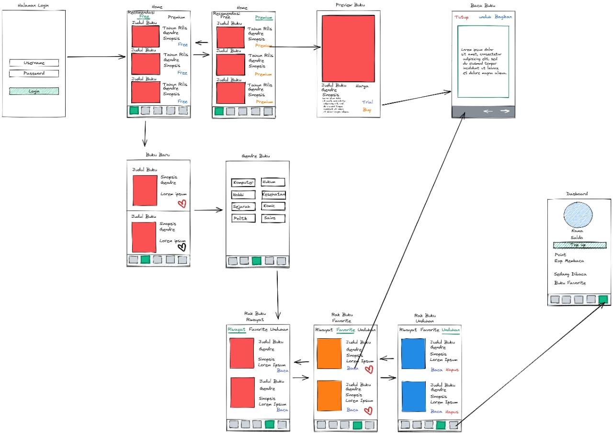

# Design Thinking Implementation
#### ini adalah dokumentasi project project selama mengikuti pelatihan Junior Web Developer G4 Tahun 2021

### Design Thinking

## A. User Pesona  

 Agus seorang mahasiswa yang sedang mencari referensi buku yang akan digunakan untuk skripsi, namun karena pandemi ia pun kesulitan, maka dari itu ia pun memutuskan untuk memilih toko buku digital namun karena buku digital harganya pun mendekati buku fisik maka dari itu ia mencar book store yang menyediakan peminjaman buku jg. 
  

## B. permasalahan yang akan diselesaikan.
- Kebutuhan si pengguna

## C. research guideline
- Teknis developer

## D. Prototyle (low fidelity) 

